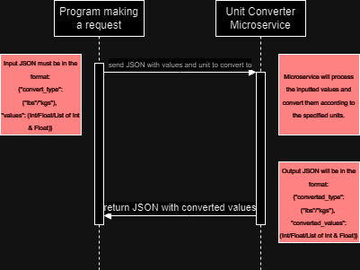

# Unit Converter

This is a microservice that converts pounds to kilograms and vice versa. All communication is based upon the ZeroMQ library.


## Making Requests

In order to make a request to the microservice, a JSON must be passed with the fields 'convert_type' and 'values'.

```
example_input_JSON = {"convert_type": "lbs", "values": 2}
```

"convert_type": Must be of type STR. Indicate 'lbs' to convert values inputted to pounds, or 'kgs' to convert values to kilograms.

"values": Must be of type INT, FLOAT, or a list of INTs and FLOATs. These values will be converted to the type as specified in "convert_type".

Given microservice communication is based on ZeroMQ, sending requests will follow ZeroMQ's protocol.

**Example Code:**
```
context = zmq.Context()

print("Connection in progress…")
socket = context.socket(zmq.REQ)
socket.connect("tcp://localhost:7777")
print("Connection established")

pack_json = {
    "convert_type": "lbs",
    "values": 2
}
socket.send_json(pack_json)
print(f"Sent JSON: {pack_json}")

convert_json = socket.recv_json()
print(f"Received JSON: {convert_json}")
```

## Receiving Data

The microservice will return the converted values within a JSON as shown below:

```
example_output_JSON = {"converted_type": "lbs", "converted_values": 4.4}
```

"converted_type": This is of type STR. This field indicates the type of the value outputted by the microservice. In this case, "4.4" is of type "pounds."

"converted_values": This is of type FLOAT, or a list of FLOATs. This is the converted value from the input.

Receiving this JSON simply involves the following lines after sending an input JSON:

```
convert_json = socket.recv_json()
print(f"Received JSON: {convert_json}")
```

## UML Sequence Diagram

